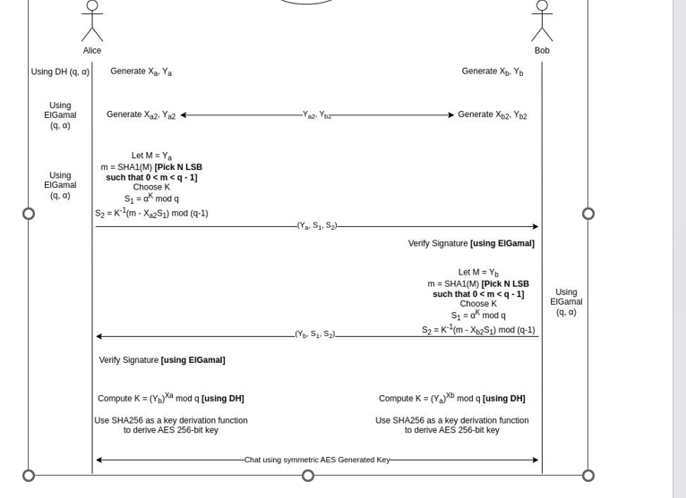

# Crypto-Chatty
<div align="center">
   
</div>

## Description
Secure chat utilizes AES256 encryption and Diffie-Hellman for key exchange. Additionally, it uses ElGamal digital signatures to send the public key of Diffie-Hellman, ensuring the identity of the sender.

## Getting Started

These instructions will help you set up and run the chat system on your local machine.

### Prerequisites

- Python 3.x
- pip (Python package manager)

### Installation

1. Clone this repository to your local machine:

    ```bash
    git clone https://github.com/yousefosama654/Crypto-Chatty
    ```
    

2. Navigate to the project directory:

    ```bash
    cd chat
    ```
    

3. Create a virtual environment to isolate dependencies:

    ```bash
    python -m venv myenv
    ```
    

4. Activate the virtual environment:

    ```bash
    source myenv/bin/activate  # On Unix/Linux
    myenv\Scripts\activate    # On Windows
    ```
    

5. Install the required Python libraries:

    ```bash
    pip install pycryptodom
    ```
    

### Usage

1. Run the server:

    ```bash
    python server.py
    ```
    

2. Run the client:

    ```bash
    python client.py
    ```


<h2 align='center' <a name = "Contributors"> ⭐ Contributors ⭐ </h2>
<!-- readme: collaborators -start -->
<table  align='center'> 
<tr>
    <td align="center">
        <a href="https://github.com/yousefosama654">
            
            <br />
            <sub><b>Yousef</b></sub>
        </a>
    </td>
    <td align="center">
        <a href="https://github.com/EmanElbedwihy">
            
            <br />
            <sub><b>Eman</b></sub>
        </a>
    </td>
        <td align="center">
        <a href="https://github.com/nesma-shafie">
            
            <br />
            <sub><b>Nesma</b></sub>
        </a>
    </td>
    <td align="center">
        <a href="https://github.com/Sara-Gamal1">
            
            <br />
            <sub><b>Sara</b></sub>
        </a>
    </td></tr>
</table>
<!-- readme: collaborators -end -->
<h2 align='center'>Thank You. 💖 </h2>
